## git基本概念

Git相当于将代码的非常多的历史版本通过一棵树的方式来管理起来

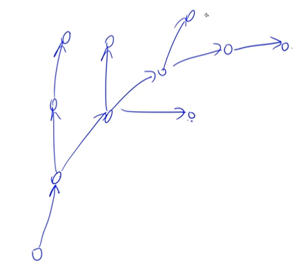

如果个人独立开发，通常意义上只需要一个分支，用于保存代码的各个版本

- 工作区：仓库的目录。工作区是独立于各个分支的，也就是没有任何关系。也就是不管在哪个分支，对应的工作区都是同一个。

- 暂存区：数据暂时存放的区域，类似于工作区写入版本库前的缓存区。暂存区是独立于各个分支的。

- 版本库：存放所有已经提交到本地仓库的代码版本，对应着上面的那棵树上的一个结点。

- 版本结构：树结构，树中每个节点代表一个代码版本。每个版本库相当于其中的节点。


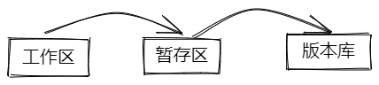

工作区相当于出发地，版本库相当于目的地，而暂存库相当于火车，存多少，什么时候存，分几次存，都在暂存区完成，等确认提交的时候，才完成了一次发车。

同时在版本的树结构中，有一个Head，指向当前提交的版本库

## git常用命令

### 基本命令

- `git config --global user.name xxx`：设置全局用户名，信息记录在`~/.gitconfig`文件中
- `git config --global user.email xxx@xxx.com`：设置全局邮箱地址，信息记录在`~/.gitconfig`文件中
- `git init`：将当前目录配置成`git`仓库，信息记录在隐藏的`.git`文件夹中
- `git add XX`：将XX文件添加到暂存区
- `git add .`：将所有待加入暂存区的文件加入暂存区
- `git rm --cached XX`：将文件从仓库索引目录中删掉
- `git commit -m "给自己看的备注信息"`：将暂存区的内容提交到当前分支
- `git status`：查看仓库状态
- `git diff XX`：查看XX文件相对于暂存区修改了哪些内容
  - 如果暂存区没有存储任何内容，则相对于当前head指针所指向的版本。
  - `q`退出

- `git log`：查看当前分支的所有版本
- `git log --pretty=oneline`：作用同上，可以排列更加整齐
- `git reflog`：查看HEAD指针的移动历史（包括被回滚的版本）
- `git reset --hard HEAD^` 或 `git reset --hard HEAD~`：将代码库回滚到上一个版本
- - `git reset --hard HEAD^^`：往上回滚两次，以此类推
  - `git reset --hard HEAD~100`：往上回滚100个版本
  - `git reset --hard 版本号`：回滚到某一特定版本
- `git checkout — XX`或`git restore XX`：将XX文件尚未加入暂存区的修改全部撤销
- `git remote add origin git@git.acwing.com:xxx/XXX.git`：将本地仓库关联到远程仓库
- `git push -u` (第一次需要-u以后不需要)：将当前分支推送到远程仓库
  - `git push origin branch_name`：将本地的某个分支推送到远程仓库

- `git clone git@git.acwing.com:xxx/XXX.git`：将远程仓库XXX下载到当前目录下

### 分支相关

- `git checkout -b branch_name`：创建并切换到`branch_name`这个分支
- `git branch`：查看所有分支和当前所处分支
- `git checkout branch_name`：切换到`branch_name`这个分支
- `git merge branch_name`：将分支`branch_name`合并到当前分支上
- `git branch -d branch_name`：删除本地仓库的`branch_name`分支
- `git branch branch_name`：创建新分支
- `git push --set-upstream origin branch_name`：设置本地的`branch_name`分支对应远程仓库的`branch_name`分支
- `git push -d origin branch_name`：删除远程仓库的`branch_name`分支
- `git pull`：将远程仓库的当前分支与本地仓库的当前分支合并
- `git pull origin branch_name`：将远程仓库的branch_name分支与本地仓库的当前分支合并
- `git branch --set-upstream-to=origin/branch_name1 branch_name2`：将远程的`branch_name1`分支与本地的`branch_name2`分支对应
  - 在绑定之前，应该先在本地创建一个名为`branch_name2`的分支的壳子
- `git checkout -t origin/branch_name` 将远程的branch_name分支拉取到本地

### stash相关

- `git stash`：将工作区和暂存区中尚未提交的修改存入栈中
- `git stash apply`：将栈顶存储的修改恢复到当前分支，但不删除栈顶元素
- `git stash drop`：删除栈顶存储的修改
- `git stash pop`：将栈顶存储的修改恢复到当前分支，同时删除栈顶元素
- `git stash list`：查看栈中所有元素

## 基本操作

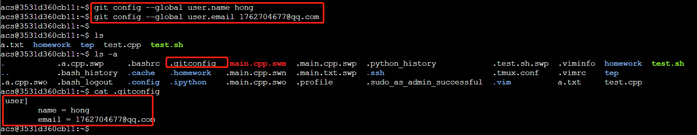

### 初始化仓库

`git init`:将当前目录配置成git仓库，信息记录在隐藏的.git文件夹中

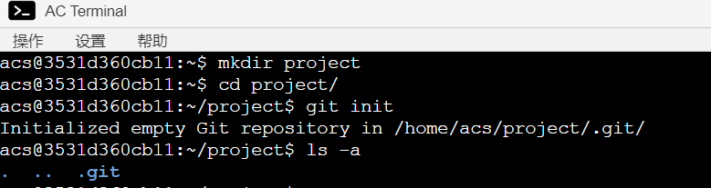

 将工作区中的新增文件，添加到暂存区。（文件由红变绿）

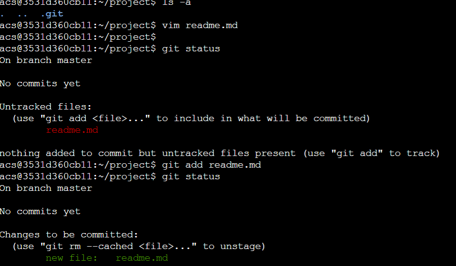

`git commit -m "给自己看的备注信息"`：将暂存区的内容提交到当前分支

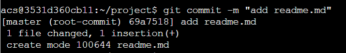

每次commit，暂存区清空

此时在版本树中，添加上了第一个结点

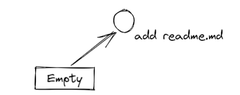

-----

如果没有提交，`readme.md`在缓存区时，如果再次对`readme.md`进行修改

`git diff XX`：查看XX文件相对于暂存区修改了哪些内容

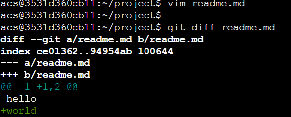

然后提交，创建了第2个结点

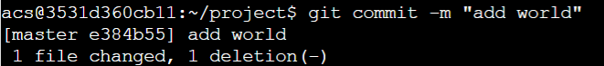

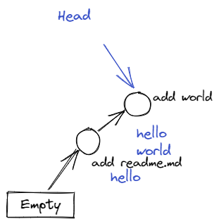

继续修改

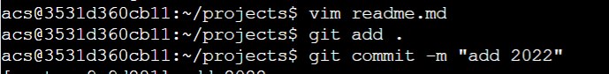

此时：

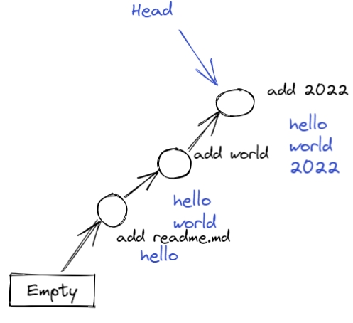

使用`git log`查看当前分支的所有版本，也就是从最初的空状态，走到当前`head`的路径

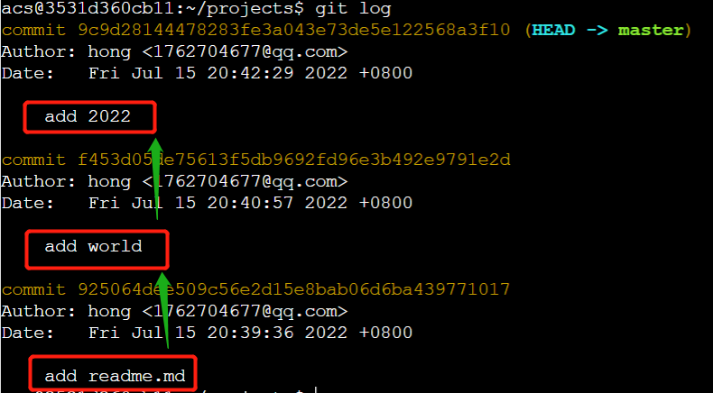

使用`git log --pretty=oneline`可以排列更加整齐

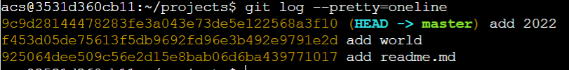

### 回滚操作

`git reset --hard HEAD^` 或 `git reset --hard HEAD~`：将代码库回滚到上一个版本

- `git reset --hard HEAD^^`：往上回滚两次，以此类推
- `git reset --hard HEAD~100`：往上回滚100个版本
- `git reset --hard  版本号`：回滚到某一特定版本

例如回滚两次：

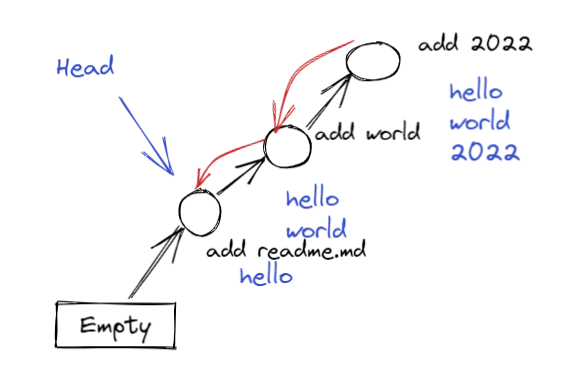

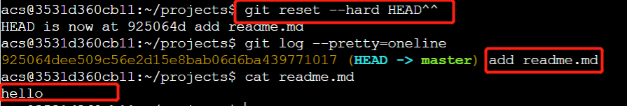

`git reflog`：查看HEAD指针的移动历史（包括被回滚的版本）


注意，在历史记录里面每一个版本结点都有一个编号被记录下来，编号是具体版本库的哈希值的前7位。

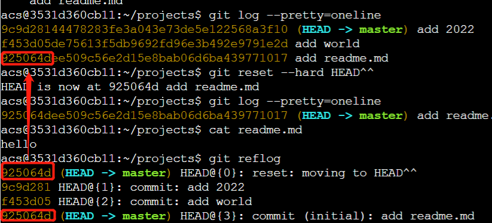

因此也可以回滚到特定版本：


此时:

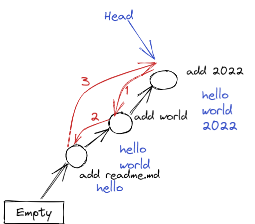

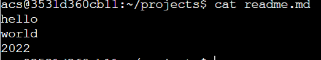

### 撤销修改

`git checkout — XX`或`git restore XX`：将XX文件尚未加入暂存区的修改全部撤销

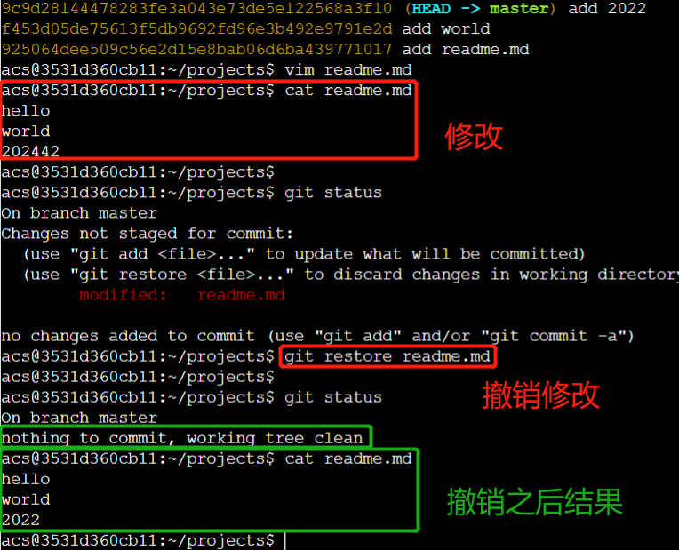

注意，这里的撤销修改并不是回滚到上一个历史版本；而是回滚到暂存区中存储的版本。如果暂存区没有存储任何内容，就回归到当前head指针所指向的版本。

例如，修改之后，添加到通过`git add .`的方式暂存区

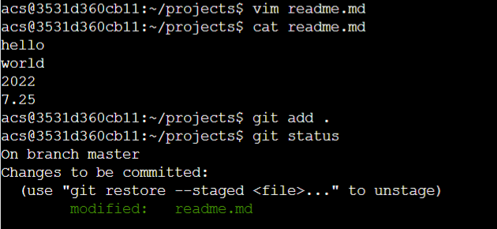

此时暂存区中的内容为

```
readme.md
    hello
    world
    2022
    7,25
```

继续修改

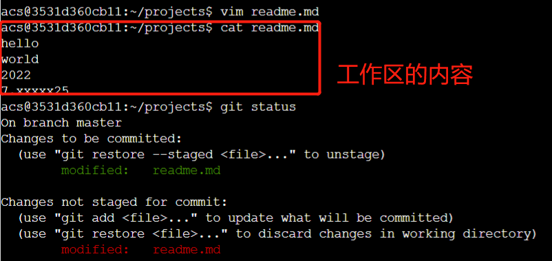

新的修改是没有价值的，于是希望将工作区相对于的暂存区的修改撤销（或者说，回滚到暂存区中存储的版本。如果暂存区没有存储任何内容，就到当回滚当前head指针所指向的版本。）

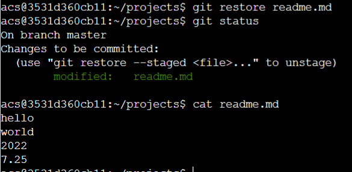

`use "git restore --staged <file>..." to unstage`

`use "git restore <file>..." to discard changes in working directory`

> 通过`git restore --staged`撤销在暂存区提交的文件变更（只是把文件从暂存区移动到工作区，且不会撤销修改的内容）最终还是通过`git restore <file>`将修改的内容撤销（由于当前暂存区没有存储文件，所以是回滚到当前head指针所指向的版本，个人理解...）

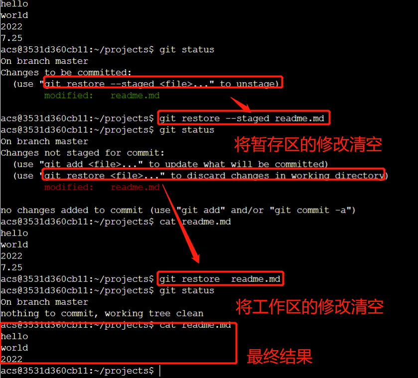

这样的话，就回到了上一个版本（当前head所指向的版本）。

### 工作区、暂存区和版本库

具体理解一下工作区、暂存区和版本库

创建一个文件，此时工作区中新增了一个`main.cpp`，暂存区没有任何文件

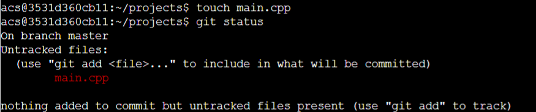

使用`git add .`将工作区中相对于暂存区的变化的内容提交到暂存区。

具体到这里，就是把`main.cpp`文件提交到暂存区

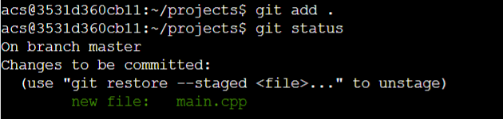

此时暂存区中更新了新内容`new file:  main.cpp`

现在，对`reademe.md`进行修改，此时工作区相对于暂存区进行了更新修改，通过`git status` ，可以看出工作区相对于暂存区做了哪些修改。如下图：

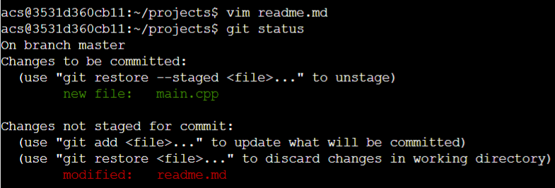

再次`git add .`将所有的修改提交到暂存区，观察到此时暂存区的内容如下：

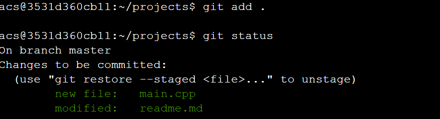

注意，不管是`new file`也好，还是`modified`也好，都是相对于当前`head`所指向的版本库而言

最后，通过``git commit -m "add main.cpp"`将暂存区的代码全部提交到版本库

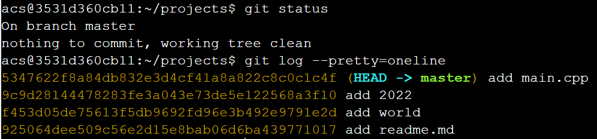

对应的版本树结构如下：

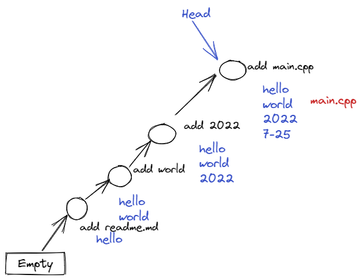

### 部分提交到暂存区

我们可以将部分文件提交到暂存区，而非是所有文件。

例如，现在同时对`main.cpp`和`readme.md`进行修改

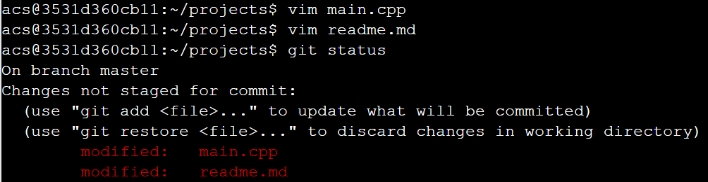

此时在工作区有两个`modified`记录

通过`git add main.cpp`，将`modified: main.cpp`添加到暂存区，`modified: readme.md`仍然留在工作区

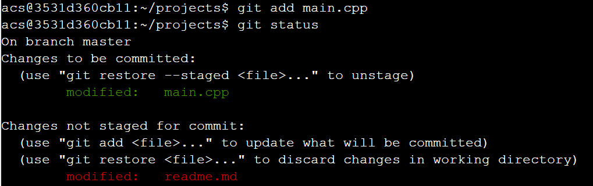

`git commit -m "save main.cpp"`将暂存区的更新持久化，生成版本库

此时暂存区中没有记录，而`modified: readme.md`仍然继续留在工作区

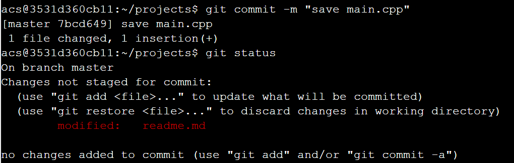

最后利用`git restore readme.md`将工作区清空

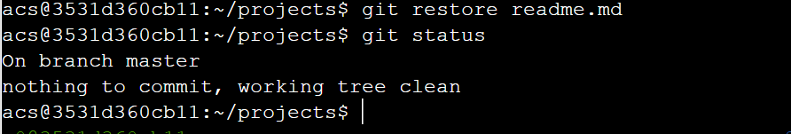

此时使用`git log --pretty=oneline`查看版本更新记录如下

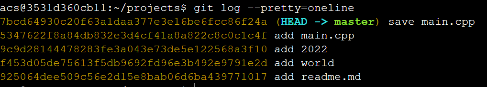

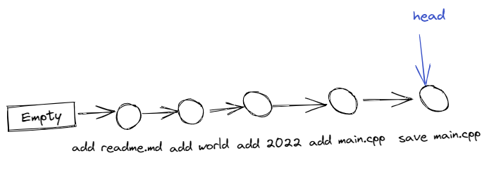

### 文件删除

首先在工作区中创建两个文件`a.txt`和`b.txt`

提交到暂存区，并持久化到版本库

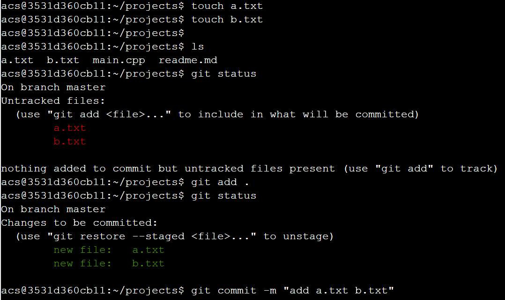

然后删除文件，此时在工作区中有两条删除记录，即：

`deleted:		a.txx`

`deleted:		b.txx`

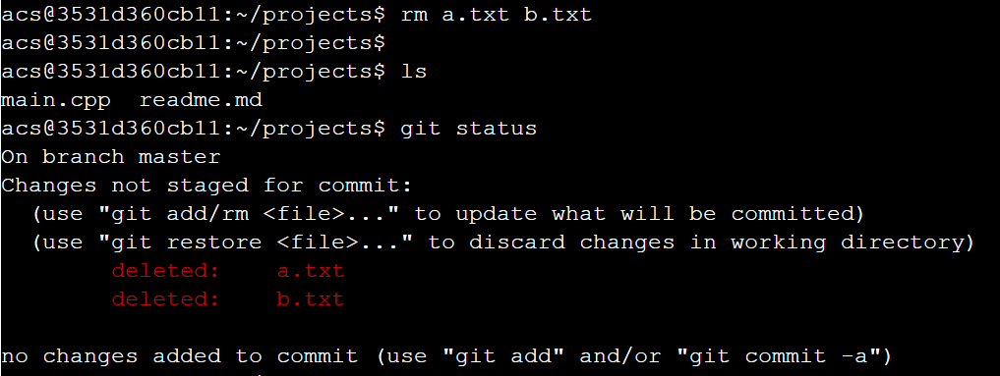

同样，也要讲删除的变更记录提交到暂存区。也就是暂存区中，不仅可以存放修改和新增的变更记录，也保存删除的变更记录。仍然使用`git add`将文件的修改提交到暂存区

尽管此时`a.txt`和`b.txt`已经在工作区中删除

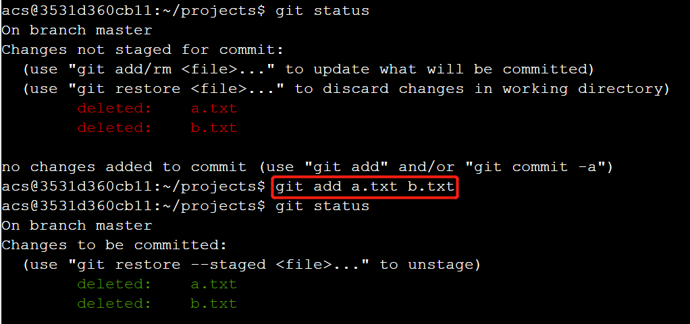

 使用`git restore --staged <file>`将在暂存区的提交的文件变更撤销（只是把文件从暂存区移动到工作区，且不会撤销修改的内容）例如，将对`b.txt`的删除保留，而将对`a.txt`的删除撤销到工作区

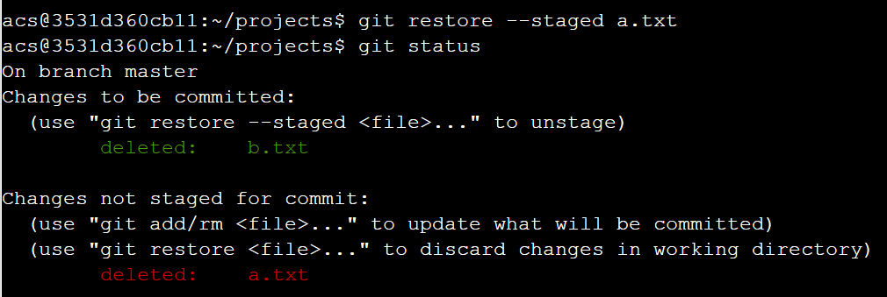

通过`git restore <file>`将工作区修改的内容撤销，在这个例子中，就可以恢复已经删除的`a.txt`

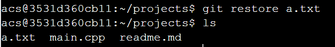

所以，通过`restore`不仅可以撤销文件的修改，甚至误删文件时，也能恢复文件。

-----

删除`a.txt`，并将暂存区持久化

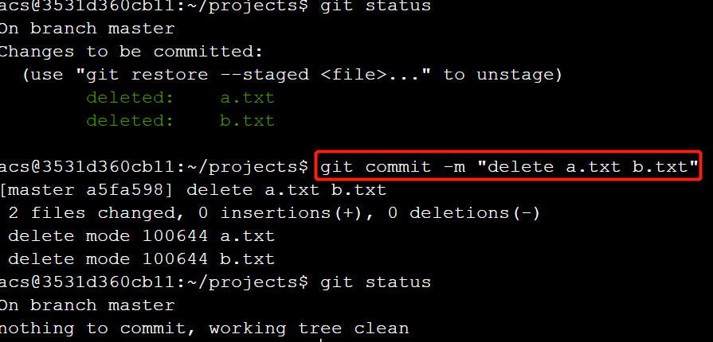

此时版本记录如下：

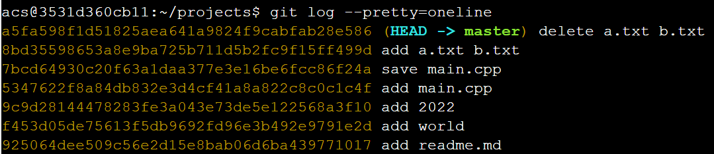

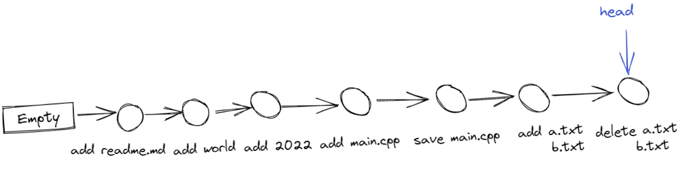

即使暂存区持久化，可以通过`git reset --hard 版本号`将代码库回滚到某一特定版本

注意，前7位是版本号。

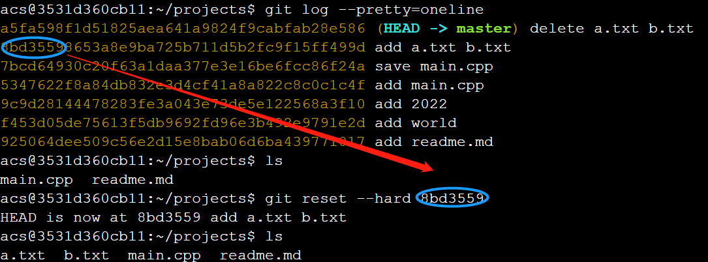

此时：

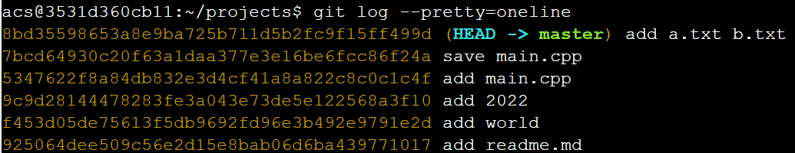

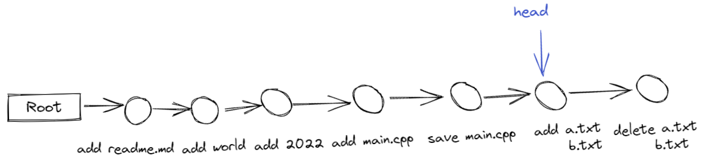

那如何回去呢，`git log`中看不到`head`前面的版本，需要借助`git reflog`：查看HEAD指针的移动历史（包括被回滚的版本）

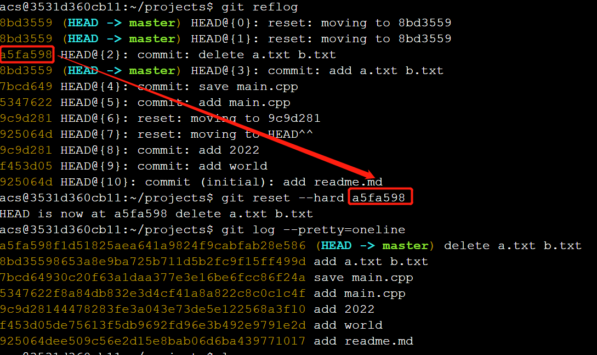

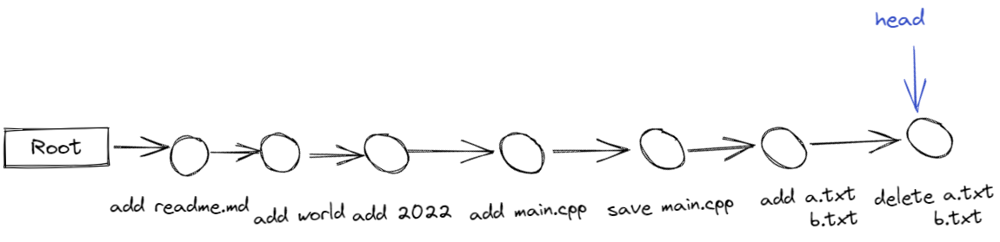

----

### 推送到远程

以上的操作都还只是`git`，与`github/gitee`没有任何关系，在本地借助`git`就可以实现代码管理	

为了防止本地出现一些故障，可以选择将代码存在云端。

首先重命名文件夹（`gitee`中禁止使用`projects`关键字）为`poject`

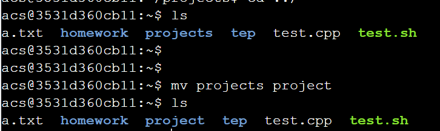

在云端创建仓库


然后需要添加SSH公钥


复制公钥到Gitee


将本地git和远程git相关联


然后将本地分支，推送到远程仓库


此时


 并且能够看到版本树中的7个版本库


也就是云端也复制了一份相同的版本树，与本地完全对应


随便点开某个版本，就能够看出修改记录


### 克隆到本地

git@gitee.com:XZHongAN/XXX.git


与之前的区别是`head`指针的移动记录没有保存

`git reflog`


但是之前的各个版本还在


### 删除本地仓库

使用`rm project -rf`

## 分支操作

### 创建合并与删除

实际的多人开发项目中，很少用到master分支。


此时开辟了一个新的分支，但是还没有建立相应的版本库（子树上还没有结点）


查看所有分支和当前所在分支


修改`readme.md`


然后将其提交到暂存区


注意：暂存区、工作区的概念是与分支完全独立的，不会因为多个分支而产生多个暂存区和工作区。工作区是车间，暂存区是火车，分支只是不同的路。提交到暂存区之后，进行commit持久化时，当前所在哪个分支，就在哪个分支建立一个版本库（结点）

将暂存区可持久化：


多个分支之间，可以切换，例如再次切换会master分支


将dev分支合并到当前分支：


这种属于：`Fast-forward`快速合并，最终得到的结果是head指向dev，没有产生复制过程。

> 如果是希望强行复制，添加`-noff`参数


此时之前专属dev的版本库，现在同属于master分支和dev分支，两者共用。


然后再将`dev`分支删掉，此时就只剩`master`分支，原来`dev`分支中的结点，正式过继给了`master`分支


### 冲突处理

添加一个新的分支dev2


修改readme.md，添加经纬度信息


 并将其持久化


 切换到master分支


添加经纬度信息，并持久化到版本库


此时，两个master的经纬度信息不一致：


合并时出错如下：自动合并失败；请修复冲突，然后提交结果


原因是两个分支都修改了`readme.md`，产生了写冲突：


进入`vim readme.md`，手动修改冲突的地方，根据需要修改文件：


并将修改后的持久化到版本库：


此时我们观察版本记录


相比于不产生冲突的合并（直接将其他分支中的结点认定为属于自己所在分支），这种合并，除了会将其他分支结点拿过来之外，还会在当前分支下，新增一个处理冲突的版本库。


然后再将`dev2`删除


此时版本记录：


注意，其中add 120,40的版本，来源是原来dev2中的版本库，只不过合并到了当前分支


相较于远程分支，多了四个版本


提交到云端：


### 其他分支同步到云端

#### 新增分支

创建分支，修改`readme.md`，新增温度字段


持久化


如果使用`git push`（将当前分支推送到远程仓库）推送当远程

提示当前分支，没有对应的云端分支。

如果正常提交，需要将当前分支与云端分支对应起来（使用提示的命令的意思是，如果云端没有这个分支，那么就在云端创建这个分支）


此时，云端也就有了两个分支，并且在dev3分支下可以看到新增的温度信息


也能看到`dev3`分支下的所有历史：

注意，每个分支有一个独立的历史，尽管有很多历史结点是共享的，例如在`dev3`中的12次提交历史中，有11次是与master分支共享的。


#### 删除分支

将`dev3`分支删除，注意，删除一个分支，需要先切换到其他分支。

会有警告信息：删除了一个还没有`merge`的分支


此时云端分支还在，如何删除云端分支呢？

* `git push -d origin branch_name`：删除远程仓库的branch_name分支


此时就只有了一个分支：


### Pull云端分支

创建一个分支，在readme.md中增加"china"，然后推送到云端


然后在本地将这个分支删除


怎样将云端的分支克隆到本地呢？


#### 合并到特定分支

首先建立一个空壳branch，然后与云端的`dev4`分支绑定

`git push --set-upstream origin branch_name`：设置本地的`branch_name`分支对应远程仓库的`branch_name`分支


此时，使用`git pull`，将远程仓库的当前分支与本地仓库的当前分支==合并==

`git pull`其实在做两件事

* 将云端分支拿下来
* `merge`到当前分支

而非简单的克隆到本地


此时的本地git版本树如下：


最后将`dev4`中的内容`merge`到`master`分支


之后再删除本地和云端的`dev4`分支


#### 合并到当前分支

`git pull origin branch_name`：将远程仓库的branch_name分支与本地仓库的当前分支合并

这次直接在云端创建一个`dev5`分支，自动共享之前的历史版本


修改文件（1），暂存更改（2），并提交持久化（3）


效果如下：


此时本地只有master分支，利用`git pull origin branch_name`：将远程仓库的branch_name分支与本地仓库的当前分支合并


此时版本提交记录变为13次（合并前为12次）


相比于云端多了一个分支：


最后`git push`提交到云端

### 云端实现合并

现在有master和dev两个分支


如何在云端创建Merge请求呢？

正常开发中，一般普通开发人员没有master权限，而且对于私有项目，即使是其他成员clone项目，需要分配权限才能clone到master


通常都是想master提交merge请求


这样项目管理员就可以进行审核


可以直观的看出哪些文件发生了改动，以及相比于master基础之上，新增了哪些提交


如果没有问题，进行合并即可


选择第一种方式，此时master分支的提交记录如下：


## stash操作

- `git stash`：将工作区和暂存区中尚未提交的修改存入栈中
  - 实际上保存的修改是工作区中的修改
- `git stash apply`：将栈顶存储的修改恢复到当前分支，但不删除栈顶元素
- `git stash drop`：删除栈顶存储的修改
- `git stash pop`：将栈顶存储的修改恢复到当前分支，同时删除栈顶元素
- `git stash list`：查看栈中所有元素

如果工作区、暂存区已经发生了修改，但是此时服务器发生了故障，只能终止当前分支的开发，需要回到之前的版本先去解决故障！

那工作区和暂存区的修改怎么办？这就要用到stash，将修改先存放到栈中

创建一个新的分支`dev6`，模拟暂存区和工作区中均发生修改的场景


使用`git stash`：将工作区和暂存区中尚未提交的修改存入栈中，之后再查看`git status`，工作区和暂存区就没有内容了。


回到主分支去解决故障


解决故障之后，再将刚刚没有做完的事情做完，回到刚刚没有开发完毕的`dev6`分支

弹出之前保存的修改到工作区

此时就可以继续开发，完成之前没有完成的工作了


再切换到master分支，将dev6中的内容合并


在合并的过程处理冲突（在这个例子中，全部保留）：


将处理冲突之后的版本持久化，最后同步到云端。


## 多人合作

在实际多人开发的场景中，并非是在master分支下，而是为每个小组开辟一个dev分支

下面创建一个dev分支，并且push到云端


假设现在有一个新的伙伴也要在dev分支开发

### 添加SSH公钥

用`ssh myserver`进入另外一台新的机器，对于一台新的机器，作为B用户，也需要将新机器的公钥传到云端

1）输出`ssh-keygen`，一直回车


2）在`.ssh`文件夹拿到公钥


3）将公钥添加到云端


### 在Dev开发

B用户在他所在的机器上：

克隆到本地

`git clone git@gitee.com:XZHongAN/project.git`

但此时只有一个分支


那怎样开发dev分支呢？

首先创建一个分支名为dev，与远程的dev绑定，再讲远程dev的merge到当前所在的dev分支


此时两个人同时写代码，修改readme.md文件，假设A用户添加了5000，B用户添加了3000 


​	并且都进行了持久化


此时的状态如下：


### 冲突触发与处理

此时A用户提交


然后B用户提交时，就会报错：

Updates were rejected because the remote contains work that you do not have locally. This is usually caused by another repository pushing to the same ref. You may want to first integrate the remote changes (e.g., 'git pull ...') before pushing again.See the 'Note about fast-forwards' in 'git push --help' for details.

更新被拒绝，==因为远程包含您在本地没有的工作==。这通常是由另一个存储库推到同一个引用引起的。在再次推之前，你可能想先集成远程更改(例如，'git pull…')。详情请参阅'git push——help'中的'Note about fast-forward '。


也就是云端版本与当前本地的版本存在冲突的地方。需要先讲冲突解决掉，然后才能push

根据提示，需要先通过git pull的方式，集成远程更改，其实就是拉取到并与本地当前分支merge，解决冲突，==解决完冲突之后再push一次==

打开`readme.md`，果不其然的出现了

```
<<<<<<< HEAD                                                                                   3000
=======
5000
>>>>>>> 2dc8246211c243a0a4207e0ed55d1fee26c9934f
```


也就是当前添加的是3000，但是云端添加的是5000，需要处理这种冲突，假设两者都保留


此时，处理完冲突之后，就可以再次将持久化为版本库，并最终push到云端。


