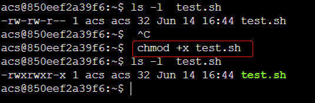
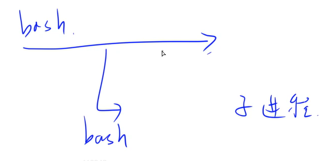
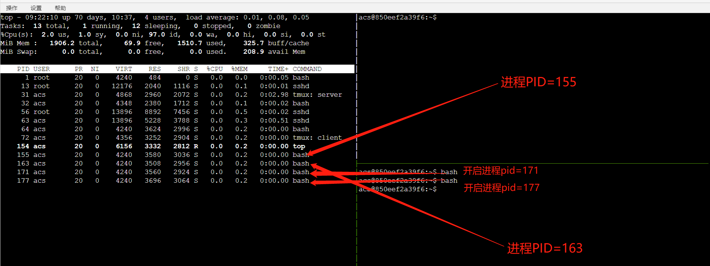
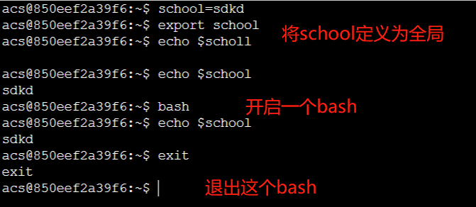
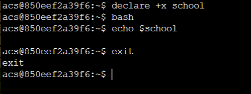
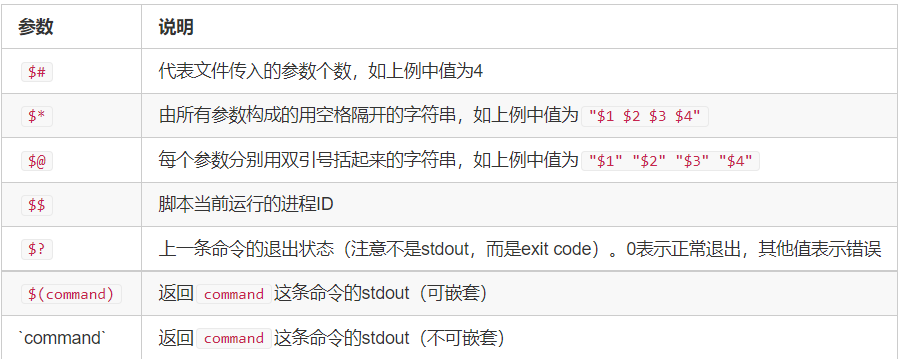
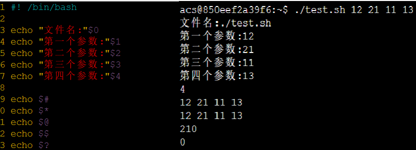
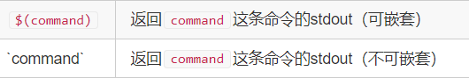
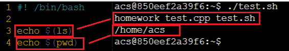
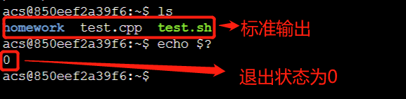

## 概论

### 简介

shell是我们通过命令行与操作系统沟通的语言，不需要编译，可以直接运行，属于解释性语言。

shell脚本可以直接在命令行中执行，也可以将一套逻辑组织成一个文件，方便复用。
AC Terminal中的命令行可以看成是一个“shell脚本在逐行执行”。

Linux中常见的shell脚本有很多种，常见的有：

* Bourne Shell(`/usr/bin/sh`或`/bin/sh`)
* Bourne Again Shell(`/bin/bash`)
* C Shell(`/usr/bin/csh`)
* K Shell(`/usr/bin/ksh`)
* zsh
  …

> 最原始的版本是sh，最常用的版本是bash

Linux系统中一般默认使用bash，所以接下来讲解bash中的语法。
文件开头需要写`#! /bin/bash`，用于指明bash为脚本解释器。

> 如果是用python作为解释器，`#! /user/env python`
>
> 不同解释器所用的命令不同，主要是方便告诉操作系统， 用哪个解释器解释我们的语言。

### 脚本示例

新建一个test.sh文件，内容如下：

```sh
#! /bin/bash
echo "Hello World!" #echo类似cout, 用于输出
```

### 运行方式

（1）作为可执行文件

如果用可执行文件来运行，需要有可执行的权限。

通过`chmod +x test.sh`  命令，使脚本具有可执行权限，变为绿色代表可执行。



`-rwxrwxr-x`表示：当前用户，同组用户以及其他用户，都能够执行。

```shell
acs@9e0ebfcd82d7:~$ chmod +x test.sh  # 使脚本具有可执行权限
acs@9e0ebfcd82d7:~$ ./test.sh  # 当前路径下执行
Hello World!  # 脚本输出
acs@9e0ebfcd82d7:~$ /home/acs/test.sh  # 绝对路径下执行
Hello World!  # 脚本输出
acs@9e0ebfcd82d7:~$ ~/test.sh  # 家目录路径下执行
Hello World!  # 脚本输出
```

（2）用解释器执行

```shell
acs@9e0ebfcd82d7:~$ bash test.sh
Hello World!  # 脚本输出
```

## 注释

### 单行注释

每行中#之后的内容均是注释。

```sh
# 这是一行注释
echo 'Hello World'  # 这也是注释
```

### 多行注释

格式：

```sh
:<<EOF
第一行注释
第二行注释
第三行注释
EOF
```

其中EOF可以换成其它任意字符串。例如：

```sh
:<<abc
第一行注释
第二行注释
第三行注释
abc
```

```shell
:<<!
第一行注释
第二行注释
第三行注释
!
```

## 变量

### 定义变量

定义变量，不需要加`$`符号，例如：

```shell
name1='yxc'  # 单引号定义字符串
name2="yxc"  # 双引号定义字符串
name3=yxc    # 也可以不加引号，同样表示字符串
```

注意，等号两边不能有空格。

在shell中，字符串可以不加''，""

### 使用变量

使用变量，需要加上`$`符号，或者符号。花括号是可选的，主要为了帮助解释器识别变量边界。

```shell
name=yxc
echo $name  # 输出yxc
echo ${name}  # 输出yxc
echo ${name}acwing  # 输出yxcacwing
```

一般推荐使用`${}`

### 只读变量

使用`readonly`或者`declare`可以将变量变为只读。

```shell
name=yxc
readonly name
declare -r name  # 两种写法均可

name=abc  # 会报错，因为此时name只读
```

### 删除变量

`unset`可以删除变量。

```shell
name=yxc
unset name
echo $name  # 输出空行, 即空字符串
```

### 变量类型

在进程内部会开启很多子进程：


1、自定义变量（局部变量）
	子进程不能访问的变量
2、环境变量（全局变量）
	子进程可以访问的变量

 对于一个pane而言，里面的shell就是一个bash进程。在当前bash中开启一个子进程：直接输入命令bash，就会进入到一个新的bash（子进程）中 ，原来的进程就会睡眠。退出当前的子进程，使用ctrl+d或者exit



（默认没有开启子进程bash的时候，ctrl+d对应的是一个pane，其实对应的也是一个bash）



自定义变量改成环境变量：

```shell
acs@9e0ebfcd82d7:~$ school=sdkd  # 定义变量
acs@9e0ebfcd82d7:~$ export school  # 第一种方法
acs@9e0ebfcd82d7:~$ declare -x school  # 第二种方法

```



环境变量改为自定义变量：

```shell
acs@9e0ebfcd82d7:~$ export school=sdkd  # 定义环境变量
acs@9e0ebfcd82d7:~$ declare +x school  # 改为自定义变量
```



### 字符串

字符串可以用单引号，也可以用双引号，也可以不用引号。

单引号与双引号的区别：

* 单引号中的内容会原样输出，不会执行、不会取变量；
* 双引号中的内容可以执行、可以取变量；（不加引号和双引号一样）

```shell
name=yxc  # 不用引号
echo 'hello, $name \"hh\"'  # 单引号字符串，输出 hello, $name \"hh\"
echo "hello, $name \"hh\""  # 双引号字符串，输出 hello, yxc "hh"
echo  hello, $name \"hh\"   # 不加引号和双引号一样，输出 hello, yxc "hh"
```

获取字符串长度

```shell
name="yxc"
echo ${#name}  # 输出3
```

提取子串

```shell
name="hello, yxc"
echo ${name:0:5}  # 提取从0开始的5个字符 输出hello
```

## 默认变量

### 文件参数变量

在执行 shell 脚本时，可以向脚本传递参数。

`$1` 是第一个参数，`$2` 是第二个参数，以此类推。特殊的，`$0` 是文件名（包含路径）。例如：

创建文件 `test.sh` ：

```shell
#! /bin/bash

echo "文件名："$0
echo "第一个参数："$1
echo "第二个参数："$2
echo "第三个参数："$3
echo "第四个参数："$4
```

然后执行该脚本：

```shell
acs@9e0ebfcd82d7:~$ chmod +x test.sh 
acs@9e0ebfcd82d7:~$ ./test.sh 1 2 3 4
文件名：./test.sh
第一个参数：1
第二个参数：2
第三个参数：3
第四个参数：4
```

### 其它参数相关变量



例如：



对于获得命令的标准输出：



例如：理解什么是一个命令的stdout标准输出。



`$?`获取的是退出状态，类似return 0;

`$(command)`获取的是输出，类似cout;



## 数组

数组中可以存放多个不同类型的值，只支持一维数组，初始化时不需要指明数组大小。
数组下标从0开始。

### 定义

数组用小括号表示，元素之间用空格隔开。例如：

```shell
array=(1 abc "def" yxc)
```

也可以直接定义数组中某个元素的值：

```shell
array[0]=1
array[1]=abc
array[2]="def"
array[3]=yxc
```

注意，数组可以跳着定义，并且没有被使用过的下标没有开辟空间

```shell
array[0]=1
array[1]=abc
array[2]="def"
array[100]=yxc
```

此时`${array[@]}`输出整个数组，结果为`1 abc def yxc`

并且`${#array[@]}`输出数组长度，结果为4

### 读取数组中某个元素的值

格式：

```Shell
${array[index]}
```
例如：

```Shell
array=(1 abc "def" yxc)
echo ${array[0]}
echo ${array[1]}
echo ${array[2]}
echo ${array[3]}
```

### 读取整个数组

格式：	

```shell
${array[@]}  # 第一种写法
${array[*]}  # 第二种写法
```

例如：

```shell
array=(1 abc "def" yxc)

echo ${array[@]}  # 第一种写法
echo ${array[*]}  # 第二种写法
```

### 数组长度

类似于字符串

```shell
${#array[@]}  # 第一种写法
${#array[*]}  # 第二种写法
```
例如
```shell
array=(1 abc "def" yxc)

echo ${#array[@]}  # 第一种写法
echo ${#array[*]}  # 第二种写法
```

## expr命令

