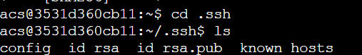

## SSH登录

### 基本用法

1）获取ssh教程配套的远程服务器账号的信息

该服务器账号可以在本地终端登录，也可以用Ac Terminal

```shell
acs@3531d360cb11:~$ homework 4 getinfo
User: acs_5866
HostName: 123.57.47.211
Password: cf1a6bdc
```

> 未来租用云服务器之后，Username通常为root，此时远程对应的就是root@hostname
>
> 但是建议在服务器中，添加一个非root用户，例如，add user hong
>
> 之后，就可以在ssh中，在Ac Terminal终端中，通过ssh hong@hostname来连接到远程服务器


SSH是说，可以在本地终端或者AC终端中，登录到其他远程服务器，SSH之后的显示的终端，就是远程服务器的终端。假设通过SSH登录到`Server1`服务器，那么此时我们看到的终端就是`Server1`服务器的终端

> 未来开发过程中，Ac Terminal终端最主要的作用就是用于连接其他远程终端的跳板。

2）登录

远程登录服务器：

```shell
ssh user@hostname
```

* `user`: 用户名

* `hostname`: IP地址或域名

所以输入

```shell
ssh acs_5866@123.57.47.211
```

第一次登录时会提示

```shell
The authenticity of host '123.57.47.211 (123.57.47.211)' can't be established.
ECDSA key fingerprint is SHA256:iy237yysfCe013/l+kpDGfEG9xxHxm0dnxnAbJTPpG8.
Are you sure you want to continue connecting (yes/no/[fingerprint])? 
```

输入`yes`，然后回车即可。
这样会将该服务器的信息记录在`~/.ssh/known_hosts`文件中。

然后输入密码即可登录到远程服务器中，此时的终端就变成了远程主机`acs_5866`的终端


​	输入`exit`，或者按住`Ctrl+D`退出


之后再次连接服务器，就没有提示信息


默认登录端口号为22。如果想登录某一特定端口：

```shell
ssh user@hostname -p 22
```

### 配置文件

在当前自己的终端环境下，创建文件` ~/.ssh/config`

然后在文件中输入：

```shell
Host myserver1
    HostName IP地址或域名
    User 用户名

Host myserver2
    HostName IP地址或域名
    User 用户名
```

之后再使用服务器时，可以直接使用别名`myserver1`、`myserver2`。


配置完之后，就可以直接通过别名连接，从而进入到远程终端


### 密钥登录

如果我们也不想每次都输入密码之后才能登录，就借助密钥登录。

在当前终端中，创建密钥：

```shell
ssh-keygen
```

然后一直回车即可。


执行结束后，`~/.ssh/`目录下会多两个文件：

* `id_rsa`：私钥
* `id_rsa.pub`：公钥



之后想免密码登录哪个服务器，就将公钥传给哪个服务器即可。

> git使用ssh来与远程github连接的原理也是如此

例如，想免密登录`myserver`服务器。则将公钥中的内容

```
ssh-rsa AAAAB3NzaC1yc2EAAAADAQABAAABgQDP6hJ2KsYEcBO4pu1qERfulMxaDtNsOGkzn25x/WU3VbZZpdVFbJc8mA50vc779Gzn1gcmzTskJaXNkQSAvNMPE7y4XHSs7Wxafanmr3oqPiED273x/J70WuRt4XKbVTkyZEOuNYsZjPyHbrC1B38AES4Y0TIOw+qb1cCCpLdlok9AfjuESvDyOw3Ob+inVemBZbmsWtc+ftk1OJPbmG2uRNg7K8xlsI6cDJcBMSJh8ly4+O1L9Rw3sPYDDkEnMpCU848W+wsOyxVzKWW3blINpDO9f/njpvC5kSHaRl/4QbtNYHvSzd3dW8D0tvt59alO0GbmvigZwg7yU7cIQ/SQ74664dNYwdSWH7wrq7/HMYZIMTQKvai73uh+ceR+jdTXpe5o8gpNR7nxSioeIuRI7WJGhsEmTKsv6ZtIc3T8g7bq2LPDjQXmXfHKRDi2oZnEjWDX7JTICdJ4IATiLplALT/aSNyqOsaAYR5PCBZj/xxYzzcIRf6W0ZJ23CqbpOU= acs@3531d360cb11
```

复制到`myserver`中的`~/.ssh/authorized_keys`文件里即可。

如果`myserver`中没有`.ssh`文件夹的话，先创建一下


进入`.ssh`文件夹中，创建`authorized_keys`文件，将公钥复制上去。

此时再次登录，就不需要密码


注意，公钥可以放在多个服务器上，实现对多个服务器的免密登录。

### 一键免密登录

也可以使用如下命令一键添加公钥：(myserver要换成自己设置的别名)

`ssh-copy-id myserver` 

### 执行命令


命令格式：

```
ssh user@hostname command
```

`ssh`会将在远程服务器中所执行命令的标准输出，重定向到当前的终端中。

例如：

```
ssh user@hostname ls -a
```

就可以直接看到在远程服务器中的使用`ls -a`命令的结果


或者

单引号中的`$i`可以求值

```
ssh myserver 'for ((i = 0; i < 10; i ++ )) do echo $i; done'
```


注意，双引号中的`$i`不可以求值，也就`i`解析不出来

```
ssh myserver "for ((i = 0; i < 10; i ++ )) do echo $i; done"
```

## SCP传文件

### 基本用法

命令格式：

```shell
scp source destination
```

将`source`路径下的文件复制到`destination`中

与`cp`命令很像，`cp`是本地的操作，`scp`是网络操作。

----

一次复制多个文件：

```
scp source1 source2 destination
```

> `scp`的底层是通过`ssh`实现

复制文件夹：

```c++
scp -r ~/tmp myserver:/home/acs/
```
表示的就是，将本地家目录中的`tmp`文件夹复制到`myserver`服务器中的`/home/acs/`目录下。

```c++
scp -r ~/tmp myserver:homework/
```

将本地家目录中的`tmp`文件夹复制到`myserver`服务器中的`~/homework/`目录下。也就如果没有绝对路径`/`开头，默认是以家目录为起点。

例如，将当前家目录中的`tep`文件夹，复制到`myserver`服务器下的家目录下


也可以将`myserver`服务器下`tep`目录复制过来


也可以用绝对路径


> 注意，在myserver: /home/下，有大量的用户名，分配给我们的只是其中一个
>
> `ssh myserver ls /home`
>
> 可以看出
>
> ​	

当然不只是复制文件夹，也可以复制文件


```
scp -r myserver:homework .
```

将myserver服务器中的`~/homework/`文件夹复制到本地的当前路径下。

指定服务器的端口号：

```
scp -P 22 source1 source2 destination
```

注意： `scp`的`-r -P`等参数尽量加在`source`和`destination`之前。

### 配置服务器

对于服务器默认的`tmux`，不支持鼠标操作，需要按住`ctrl+B`，不方便按，Ac terminal中改成了`ctrl+A`，且支持鼠标操作；对于服务器默认的`vim`没有行号

怎样将远程服务器设置为与Ac terminal中一样的配置呢

使用`scp`配置其他服务器的`vim`和`tmux`，本质上就是将家目录下的`.tmux.conf`和`.vimrc	`文件，复制到`myserver`的家目录下。

```
scp .bashrc .vimrc .tmux.conf server_name:  # server_name需要换成自己配置的别名 zhihongx
```


此时，再次测试，即可实现`vim`和`tmux`的基本设置。