## tmux

### 功能

​    (1) 分屏。
​    (2) 允许断开Terminal连接后，继续运行进程。

### 结构

 一个tmux可以包含多个session，一个session可以包含多个window，一个window可以包含多个pane。

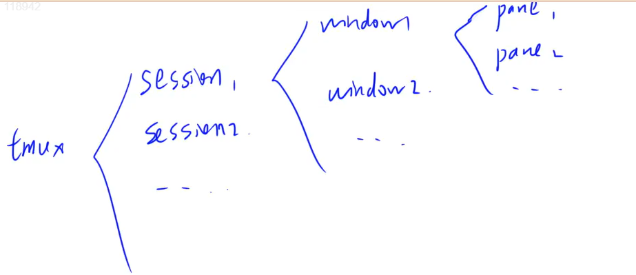

实例：
        tmux:
            session 0:
                window 0:
                    pane 0
                    pane 1
                    pane 2
                    ...
                window 1
                window 2
                ...
            session 1
            session 2
            ...

对于每一个pane，都会开一个shell。

### 操作

1、`tmux`：新建一个`session`，其中包含一个`window`，`window`中包含一个`pane`，`pane`里打开了一个`shell`对话框。

第一个启动的 Tmux 窗口，编号是`0`，第二个窗口的编号是`1`，以此类推。这些窗口对应的会话，就是 0 号会话、1 号会话。使用编号区分会话，不太直观，更好的方法是为会话起名。

```
$ tmux new -s <session-name>
```

上面命令新建一个指定名称的会话。

所看到的页面是一个`window`，所以一般而言，为了方便使用，通常

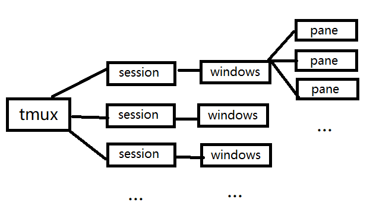

2、按下`Ctrl + a`后手指松开，然后按`%`：将当前pane左右平分成两个pane。
3、 按下`Ctrl + a`后手指松开，然后按`"`（注意是双引号"）：将当前pane上下平分成两个pane。
4、`Ctrl + d`：关闭当前pane；如果当前`window`的所有`pane`均已关闭，则自动关闭`window`；如果当前`session`的所有`window`均已关闭，则自动关闭`session`。
5、鼠标点击可以选`pane`。
6、按下`ctrl + a`后手指松开，然后按方向键：选择相邻的`pane`。
7、鼠标拖动`pane`之间的分割线，可以调整分割线的位置。
8、按住`ctrl + a`的同时按方向键，可以调整`pane`之间分割线的位置。
9、按下`ctrl + a`后手指松开，然后按`z`：将当前`pane`全屏/取消全屏。
10、按下`ctrl + a`后手指松开，然后按`d`：挂起当前`session`。

> 注意挂起当前`session`不是关闭，如果直接`Ctrl + d`则会关闭

11、`tmux a`：打开之前挂起的session。

或者`tmux attach`，`tmux a`中的`a`是`attach`的缩写。

> `tmux ls`查看创建的所有会话
>
> `tmux a -t aaa`登录一个已知会话，后面的aaa是会话名称

12、按下ctrl + a后手指松开，然后按s：选择其它session。
        方向键 —— 上：选择上一项 session/window/pane
        方向键 —— 下：选择下一项 session/window/pane
        方向键 —— 右：展开当前项 session/window
        方向键 —— 左：闭合当前项 session/window

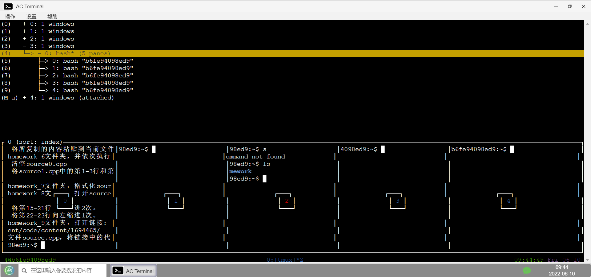   

 13、按下Ctrl + a后手指松开，然后按c：在当前session中创建一个新的window。

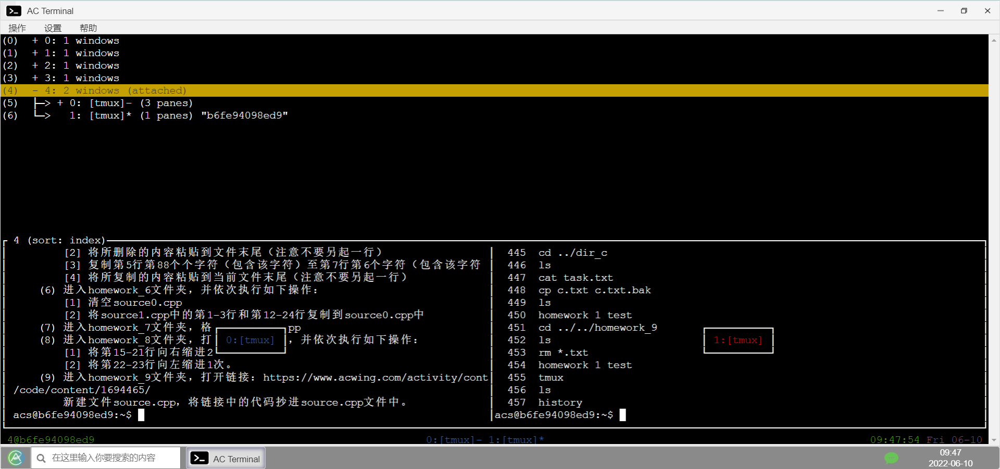

14、按下Ctrl + a后手指松开，然后按w：选择其他window，操作方法与(12)完全相同。

不同的是，默认展开到window这一级

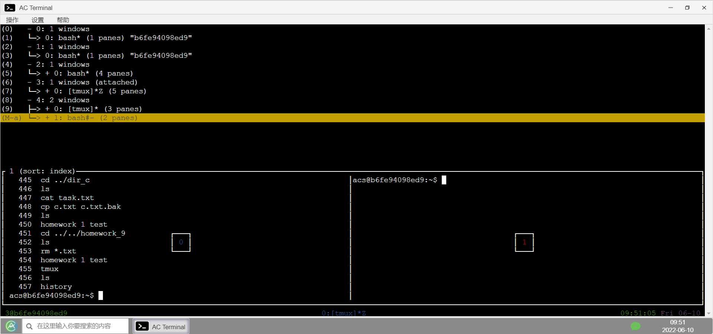

一般而言，由于window就是当前所看到的窗口，多个windows的话不方便查看，因此可以选择一个session只建立一个window，然后一个window之上建立多个pane。

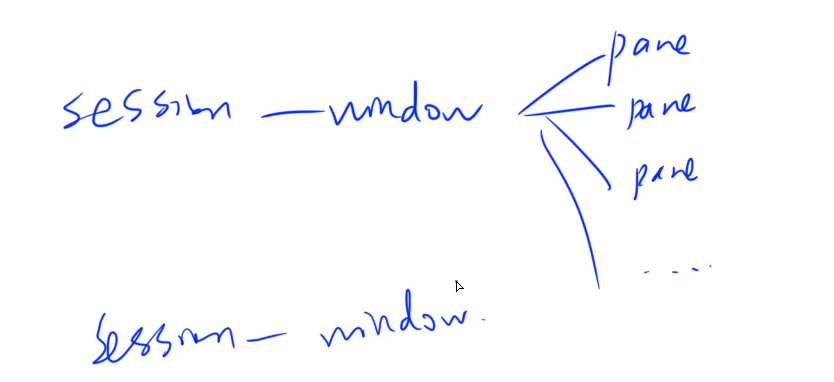

15、按下Ctrl + a后手指松开，然后按PageUp：翻阅当前pane内的内容。
16、鼠标滚轮：翻阅当前pane内的内容。
17、在tmux中选中文本时，需要按住shift键。（仅支持Windows和Linux，不支持Mac，不过该操作并不是必须的，因此影响不大），选中文本之后，可以使用ctrl+insert的方式复制，shift+insert的方式粘贴。
18、tmux中复制/粘贴文本的通用方式：
        (1) 按下Ctrl + a后松开手指，然后按[
        (2) 用鼠标选中文本，被选中的文本会被自动复制到tmux的剪贴板
        (3) 按下Ctrl + a后松开手指，然后按]，会将剪贴板中的内容粘贴到光标处

## vim

### 功能

​    (1) 命令行模式下的文本编辑器。
​    (2) 根据文件扩展名自动判别编程语言。支持代码缩进、代码高亮等功能。
​    (3) 使用方式：vim filename
​        如果已有该文件，则打开它。
​        如果没有该文件，则打开个一个新的文件，并命名为filename

### 模式

​    (1) 一般命令模式
​        默认模式。命令输入方式：类似于打游戏放技能，按不同字符，即可进行不同操作。可以复制、粘贴、删除文本等。但是在一般命令模式下，不能编辑。
​    (2) 编辑模式
​        在一般命令模式里按下i，会进入编辑模式。**（下方出现insert字样）**
​        按下ESC会退出编辑模式，返回到一般命令模式。
​    (3) 命令行模式
​        在一般命令模式里按下:/?三个字母中的任意一个，会进入命令行模式。命令行在最下面。
​        可以查找、替换、保存、退出、配置编辑器等。

### 操作

1、i：进入编辑模式
2、ESC：进入一般命令模式，不管当前处于那个模式。

ESC所做的是返回默认模式（一般命令模式）

3、 光标移动：

* h 或 左箭头键：光标向左移动一个字符
* j 或 向下箭头：光标向下移动一个字
* k 或 向上箭头：光标向上移动一个字
* l 或 向右箭头：光标向右移动一个字符

4、 n\<Space\>：n表示数字，按下数字后再按空格，光标会向右移动这一行的n个字符
5、0 或 功能键[Home]：光标移动到本行开头\$或功能键[End]：光标移动到本行末尾
6、G：光标移动到最后一行(按住shift+G)
7、:n 或 nG：n为数字，光标移动到第n行

> 前者是在命令行模式下，后者是在一般命令模式下

8、gg：光标移动到第一行，相当于1G
9、n\<Enter\>：n为数字，而不是字幕n，光标向下移动n行
10、/word：向光标之下寻找第一个值为word的字符串。

> 一般命令模式下，先按下/，进入命令行模式。然后输入word，进行查找。

11、?word：向光标之上寻找第一个值为word的字符串。
12、n：重复前一个查找操作
13、N：反向重复前一个查找操作

> 需要先按住esc，在一般命令模式下使用

14、:n1,n2s/word1/word2/g：n1与n2为数字，在第n1行与n2行之间寻找word1这个字符串，并将该字符串替换为word2

例如输出:5,8s/int/double/g

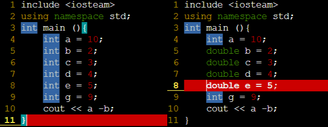

使用:noh 关闭查找关键词高亮

15、:1,\$s/word1/word2/g：将全文的word1替换为word2
16、:1,$s/word1/word2/gc：将全文的word1替换为word2，且在替换前要求用户确认。
17、v：选中文本

> 选中文本之后，可以删除，复制操作，连按两下Esc，取消选中。

18、d：删除选中的文本，d实际上是剪切选中的文本，可以通过p，在光标的下一个位置粘贴回来

> 如果将当前文件中的文本全部删除：
>
> ggdG
>
> * gg：光标移动到第一行
> * d：表示要进行删除操作，开启删除模式
> * G：表示一直删到最后一行
>
> :n
>
> * :n 表示跳转到第n行
> * d 开启删除模式
>
> d n
>
> * n 从当前位置删除到第n行
> * 若n为G 表示从当前位置开始删一直删到最后一行

19、dd: 删除当前行，dd实际上是剪切整行，可以通过p，在光标的下一行粘贴回来
20、y：复制选中的文本（需要先用v选中）
21、yy: 复制当前行（不用选中，直接复制的是光标所在的行）
22、p: 将复制的数据在光标的下一个位置/下一行粘贴。

> 如果是用y复制的文本，粘贴的时候在下一个位置；
>
> 如果是用yy复制的一整行，则粘贴的时候在下一行；

**23、u：撤销**

> 相当于win中的Ctrl+Z

24、Ctrl + r：取消撤销

> 相当于win中的Ctrl+Y

25、大于号 >：将选中的文本整体向右缩进一次
26、小于号 <：将选中的文本整体向左缩进一次
27、:w 保存
28、:w! 强制保存

> 在只读文件中这样报错，当然，如果是root用户下面的文件，未必可以，不一定有这个权限。

29、:q 退出
30、:q! 强制退出

> 也就是不保存，直接退

31、:wq 保存并退出，:wq! 强制保存并退出
32、:set paste 设置成粘贴模式，取消代码自动缩进

如果不设置成粘贴模式，复制这样一段代码：

```c++
int main()
{
    cin>>n>>V;
    for (int i=0;i<n;++i)
    {
        int a,b;
        cin>>a>>b;
        v[i]=a;w[i]=b;
    }
    memset(f,0,sizeof f);
    for (int i=0;i<n;++i)
        for (int j=V; j>=v[i];j--)
            f[j]=max(f[j],f[j-v[i]]+w[i]);

    cout<<f[V]<<endl;    
    return 0;
}
```

会显示下面，是因为遇回车，又再一次执行了代码缩进

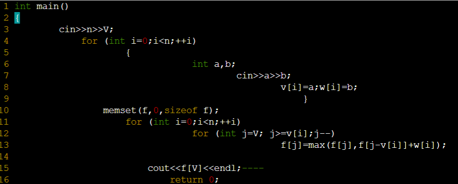

设置成粘贴模式之后，再次粘贴：

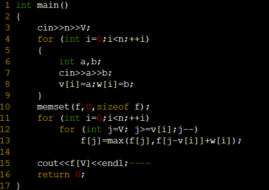

速度很快，而且即使代码很长，也不会崩掉。

33、:set nopaste 取消粘贴模式，开启代码自动缩进

> 此时在这种模式下，回车的时候，代码自动缩进，适合写代码

34、:set nu 显示行号
35、:set nonu 隐藏行号
36、=，将选择的文本格式化；==，对当前行进行格式化

> gg=G：将全文代码格式化
>
> * gg：光标移动到第一行
> * =：表示要进行格式化操作，开启格式化
> * G：表示一直删到最后一行

37、:noh 关闭查找关键词高亮
 38、Ctrl + q：当vim卡死时，可以取消当前正在执行的命令

> 例如，如果使用gg=G，而且此时代码量过大，就可能卡掉，因此需要借助Ctrl + q

### 异常处理

每次用vim编辑文件时，会自动创建一个.filename.swp的临时文件。
如果打开某个文件时，该文件的swp文件已存在，则会报错。

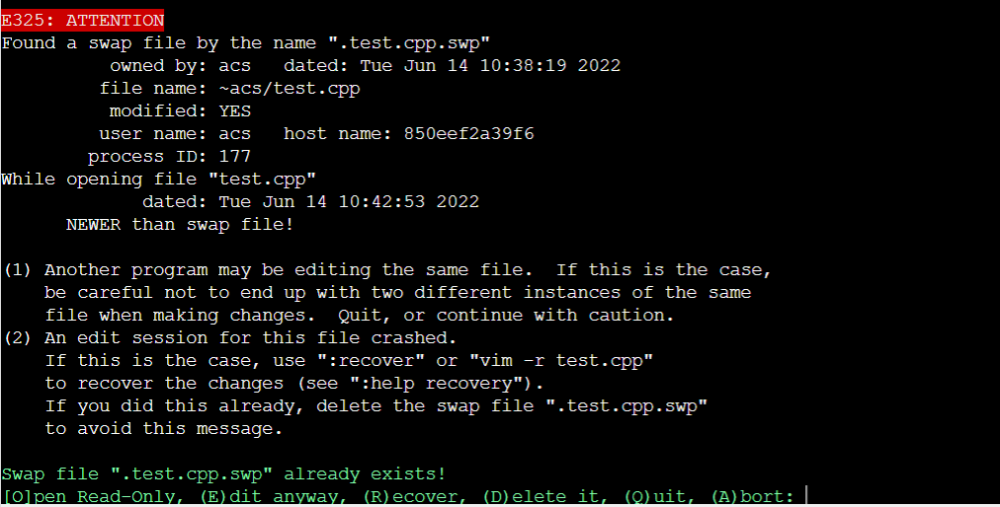

此时解决办法有两种：
​        (1) 找到正在打开该文件的程序，并退出
​        (2) 直接删掉该swp文件即可

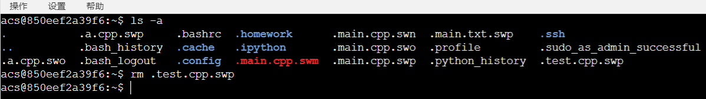