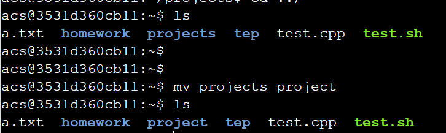

### 文件管理命令

1、`ctrl c`: 取消命令，并且换行
2、`ctrl u`: 清空本行命令，一般不常用，可以直接用`ctrl c`即可
3、`tab`键：可以补全命令和文件名，如果补全不了快速按两下`tab`键，可以显示备选选项
4、`ls`: 列出当前目录下所有文件，蓝色的是文件夹，白色的是普通文件，绿色的是可执行文件

> `ls -l XX`，可以看到详细的文件信息，包括文件权限。
>
> ```sh
> acs@850eef2a39f6:~$ ls -l  test.sh
> -rw-rw-r-- 1 acs acs 32 Jun 14 16:44 test.sh 
> ```
> 前边两个为当前用户本身权限，中间为同组权限，后面为其他用户权限。
>
> * `r`读权限
> * `w`写权限
> * `x`执行权限

5、`pwd`: 显示当前路径

> pwd显示的是绝对路径
>
> 绝对路径：`/xx/xxx`
>
> 相对路径：`xx/xxx`

6、`cd XXX`: 进入`XXX`目录下，`cd ..` 返回上层目录，`cd -`返回上一个目录

> 注意`cd -`返回的是上一个呆过的目录，而不是上层目录。例如上一个所在目录是`/A`，当前所在目录为`/B`，则使用`cd -`返回`/A`，再使用`cd -`返回`/B`
>
> `cd ~`返回当前用户的家目录，或者直接`cd`也可以返回当前用户的家目录

7、`cp XXX YYY`: 将`XXX`文件复制到`YYY`中，`XXX`可以是一个目录，也可以是一个文件；`YYY`是一个目录

用法举例：

`cp a/temp.txt b` #表示将`a`文件夹中的`temp.txt`拷贝到`b`文件夹中去
`cp a/temp.txt b/temp2.txt` #表示将`a`文件夹中的`temp.txt`拷贝到`b`文件夹中去，同时重命名为`temp2.txt`

`cp a b -r` #将`a`整个文件夹，拷贝到`b`目录下面，注意，后面有一个参数`"r"`。注意，如果b不存在，则执行的是`b==a`，相当于直接拷贝一个`a`文件夹，重命名为`b`

> 对于文件夹的操作，例如复制，删除，需要加一个参数r，r是递归（recursive）的缩写。

8、`mkdir XXX`，使用`mkdir`创建目录`XXX`，`touch xx.txt`，使用`touch`创建文件

参数：`p`，如果有，就利用，如果没有，就创建。例如，`mkdir a/b/c`，如果`a/b`存在，就直接创建`c`，如果`a/`存在，`a/b/`不存在，则先创建`b`，再创建，以此类推。


运行如下：


9、`rm XXX`: 删除普通文件;  `rm XXX -r`: 删除文件夹

支持同时删除多个文件：


也支持使用正则表达式：


如果删除`a`中的内容，保留`a`这个目录，如果`a`中除了文件还有其他目录，就加上`-r`


10、`mv XXX YYY`: 将`XXX`文件移动到`YYY`，和`cp`命令一样，`XXX`和`YYY`可以是一个路径；

> 注意，重命名也是用这个命令

`mv`相当于剪切+粘贴+（重命名）

用法举例：

`mv a/t1.txt b/` #将`a`中的`t1.txt`移动到`b`目录下；

`mv a/t1.txt b/t2.txt` #将`a`中的`t1.txt`移动到`b`目录下，并重命名为`t2.txt`；

重命名：

在当前目录下使用`mv`，实现重命名效果：

`mv t1.txt t2.txt`，在当前目录下实现剪切+粘贴，实现的效果就是单纯的重命名，注意重命名也可以对文件格式进行重命名，例如`mv t1.txt t2.cpp`，只不过后者在vim打开显示的时候有了高亮效果。

`mv A B`  将目录A重命名为B*



11、`touch XXX` :创建一个文件
12、`cat XXX`: 展示文件`XXX`中的内容


13、复制文本
    `windows/Linux`下：`Ctrl + insert`，`Mac`下：`command + c`
14、粘贴文本
    `windows/Linux`下：`Shift + insert`，`Mac`下：`command + v`。

15、`history` 查看历史命令

### GPU进程相关

查看当前使用GPU的进程

```
nvidia-smi
```


停止NVIDIA的GPU进程

```perl
kill -9 PID
```


