## 概述

云平台的作用:

1. 存放我们的docker容器，让计算跑在云端。
2. 获得公网IP地址，让每个人可以访问到我们的服务。

任选一个云平台即可，推荐配置：

1. 1核 2GB（后期可以动态扩容，前期配置低一些没关系）
2. 网络带宽采用按量付费，最大带宽拉满即可（费用取决于用量，与最大带宽无关）
3. 系统版本：ubuntu 20.04 LTS（推荐用统一版本，避免后期出现配置不兼容的问题）

## 租云服务器

[腾讯云](https://console.cloud.tencent.com/)

https://www.huaweicloud.com/

腾讯云会默认分配的是一个ubantu用户，一个具有sudo权限的非root用户。

### 登录到新服务器

打开AC Terminal，然后：

```python
ssh ubantu@xxx.xxx.xxx.xxx  # 注意腾讯云登录的用户不是root，而是ubuntu,这一点不同于阿里云和华为云
```

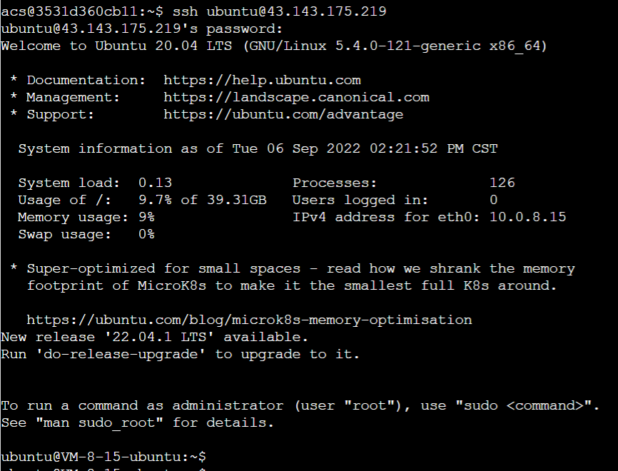

可以用ubantu创建一个新的用户zhihongx

```python
sudo adduser zhihongx  # 创建用户zhihongx
sudo usermod -aG sudo zhihongx  # 给用户zhihongx分配sudo权限
```

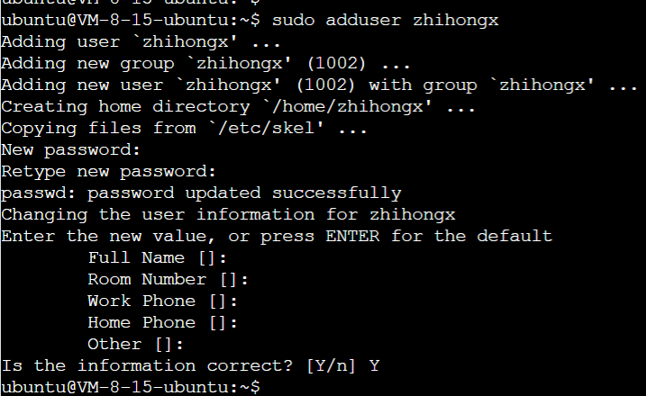

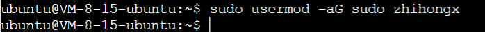

注意，切换用户使用su

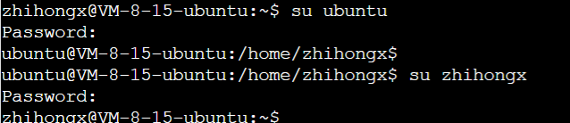

### 配置免密登录方式

退回AC Terminal，然后配置`zhihongx`用户的别名

创建文件 `~/.ssh/config`

```
vim ~/.ssh/config
```

然后在文件中输入：

```
Host myserver1
    HostName IP地址或域名
    User 用户名

Host myserver2
    HostName IP地址或域名
    User 用户名
```

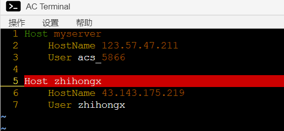

之后再使用这个腾讯云服务器时，可以直接使用别名`zhihongx`

### 密钥登陆

创建密钥：

```
ssh-keygen
```


然后一直回车即可。

执行结束后，~/.ssh/目录下会多两个文件：

- id_rsa：私钥

- id_rsa.pub：公钥

之后想免密码登录哪个服务器，就将公钥传给哪个服务器即可。

例如，想免密登录myserver服务器。则将公钥中的内容，复制到myserver中的~/.ssh/authorized_keys文件里即可。

也可以使用如下命令一键添加公钥：

使用如下命令一键添加公钥：

```python
ssh-copy-id myserver  #myserver需要换成自己配置的别名，这里是zhihongx
```

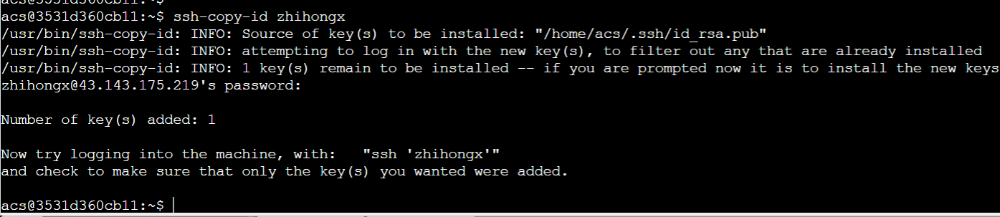

此时，就可以直接通过免密登录，进入到腾讯服务器中，自己创建的用户下。

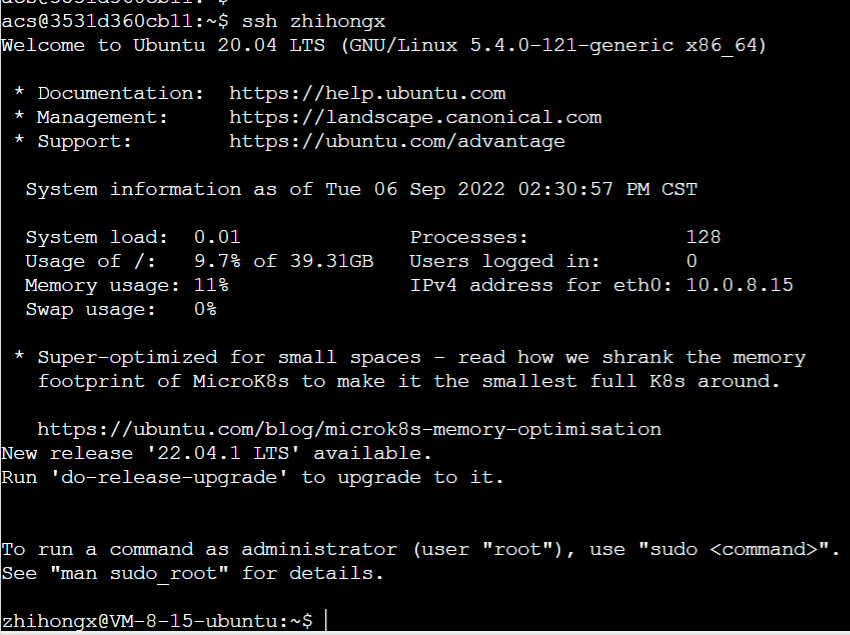

### 配置新服务器的工作环境

将AC Terminal的配置传到新服务器上：

```python
scp .bashrc .vimrc .tmux.conf server_name:  # server_name需要换成自己配置的别名 zhihongx
```

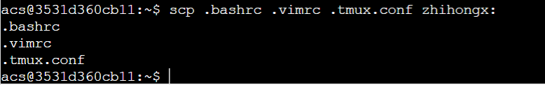

### 安装tmux和docker

登录自己的服务器，然后安装tmux：

```python
sudo apt-get update #首先执行这一句
sudo apt-get install tmux
```

打开tmux（养成习惯，所有工作都在tmux里进行，防止意外关闭终端后，工作进度丢失）

然后在tmux中根据[docker安装教程](https://docs.docker.com/engine/install/ubuntu/)安装docker即可，当可以显示出docker版本，说明安装完成。

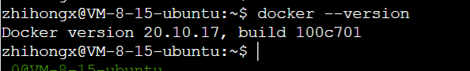

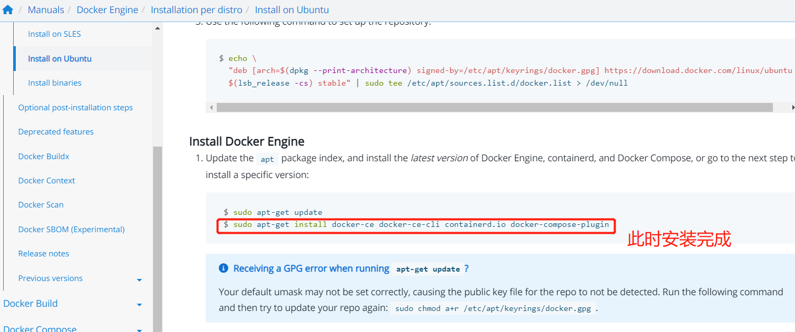

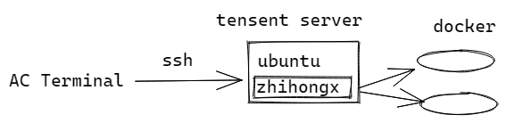

未来的主要工作场所在Docker中，相当于虚拟环境，方便环境迁移。

