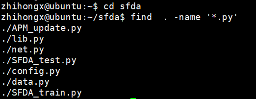

## 管道

### 概念


管道类似于文件重定向，可以将前一个命令的stdout重定向到下一个命令的stdin。

### 要点

- 管道命令仅处理stdout，会忽略stderr。
- 管道右边的命令必须能接受stdin。
- 多个管道命令可以串联。

### 与文件重定向的区别

- 文件重定向左边为命令，右边为文件。
- 管道左右两边均为命令，左边有stdout，右边有stdin。

### 举例

统计当前目录下所有python文件的总行数，其中find、xargs、wc等命令可以参考常用命令这一节内容。

```Shell
find . -name '*.py' | xargs cat | wc -l
```

1）寻找当前目录下的所有"*.py"文件

